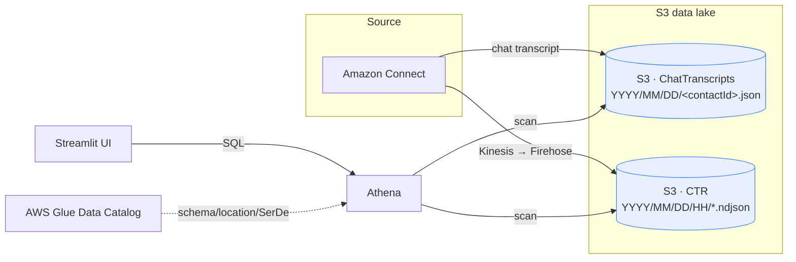
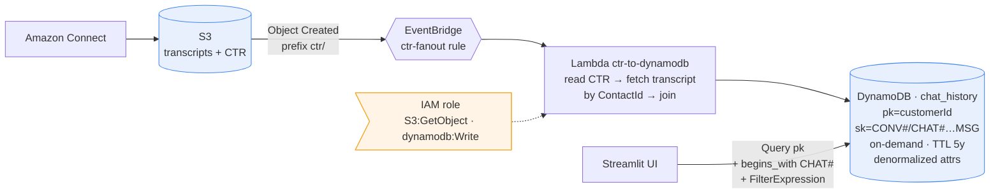
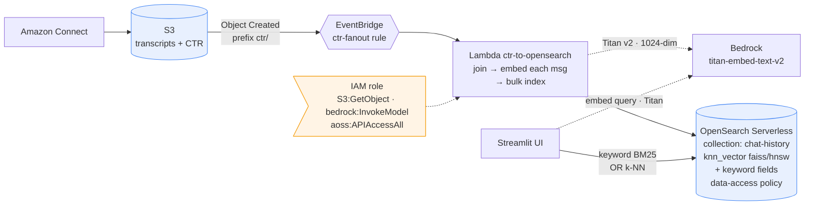
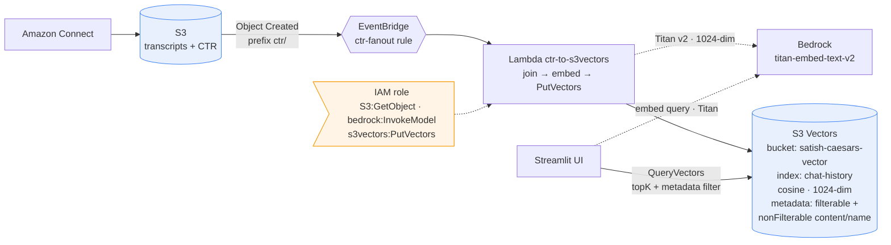

# Chat History Retrieval — Demo

## The Problem

- Chat transcripts land in S3 from Amazon Connect;
- Today's tool queries via **Athena** — flexible but **slow** (~seconds) and
  **keyword-only** (no "find conversations _about_ X").
- Goal: fast retrieval for agents + **semantic search** for analysts.

---

## Architecture — per use case

### Case 1 — S3 + Athena

_No pre-processing — Athena reads the raw S3 files and does all the work at search
time. Flexible, but slow because every query re-scans and re-joins the data._

### Case 2 — DynamoDB

_Join happens **once at ingest**; single-table item collection per customer. Reads
are direct key lookups (no join, no scan) — millisecond retrieval._

### Case 3 — OpenSearch (Serverless)

_Serverless can't self-embed → the Lambda calls Titan. Index holds both analyzed
text (keyword) and the vector (semantic). Query embeds via Titan then k-NN._

### Case 4 — S3 Vectors

_Identical ingest+embed to Case 3, but vectors live in an S3 Vectors index (no
cluster). Metadata stored per vector enables filtered semantic search._

> All three ingest cases (2–4) share **one EventBridge rule (`ctr-fanout`)** that
> fans a single CTR upload out to all three Lambdas — so one sync loads every store.

---

## Price breakdown

**Assumptions**

_Volume & data_

- Message volume: **236K inbound + 1.5M outbound = 1.74M/month** (outbound includes one-way promo SMS)
- Retention: **5 years** → ~**104M messages**
- Avg message size: **0.5 KB** (text + JSON metadata; inbound chat and outbound/SMS)
- Text storage: ~52 GB messages + CTR/file overhead → **~150 GB raw in S3**

_Vectors (cases 3 & 4)_

- Embedding model: **Amazon Titan Text Embeddings V2**
- Dimensions: **1024** · Precision: **float32 (4 B/number)** → **4 KB/vector**
- Granularity: **one vector per message** → ~**104M vectors** → **~430 GB**
- Tokens: ~20/message @ **$0.02 / 1M tokens** (backfill ~$40 one-time, ongoing <$1/mo)
- Embedded content: **all text messages** (incl. promo SMS)

_Environment_

- Region **us-west-2**, on-demand billing
- Query volume: **~500 searches/day** (placeholder — drives Athena & DynamoDB read cost)

### Case 1 — S3 + Athena

| Component                | Rate                  | Est. / month                                                         |
| ------------------------ | --------------------- | -------------------------------------------------------------------- |
| S3 storage (~50 GB text) | $0.023/GB             | **~$1**                                                              |
| Athena queries           | $5 / TB scanned       | **query-driven** (e.g. 500 queries × 0.2 GB pruned ≈ 0.1 TB ≈ $0.50) |
| Glue Data Catalog        | first 1M objects free | ~$0                                                                  |
| **Total**                |                       | **~$1–10** (scales with query volume × scan size)                    |

### Case 2 — DynamoDB

| Component              | Rate          | Est. / month |
| ---------------------- | ------------- | ------------ |
| Storage (~50 GB items) | $0.25/GB      | **~$12**     |
| Writes (ingest ~2M/mo) | $1.25 / M WRU | **~$2.5**    |
| Reads (query volume)   | $0.25 / M RRU | **~$1–5**    |
| **Total**              |               | **~$15–20**  |

_Storage cost grows steadily with the 5-year retention; reads/writes cheap at this
volume. Add a GSI only if you need non-key access (extra storage + writes)._

### Case 3 — OpenSearch Serverless

| Component                           | Rate             | Est. / month                                   |
| ----------------------------------- | ---------------- | ---------------------------------------------- |
| OCUs (compute)                      | ~$0.24 / OCU-hr  | **~$350 (2 OCU dev) – $700 (4 OCU redundant)** |
| Storage (~50 GB text + vectors)     | ~$0.024/GB       | **~$2**                                        |
| Bedrock Titan — backfill (one-time) | $0.02 / M tokens | ~$40 one-time                                  |
| Bedrock Titan — ongoing embeds      | $0.02 / M tokens | **<$1**                                        |
| **Total**                           |                  | **~$350–700 (dominated by always-on OCUs)**    |

_Highest floor: you pay for OCUs 24/7 even when idle. Fastest search, though._

### Case 3b — OpenSearch (reuse existing cluster)

Assumes the customer's current cluster has (or adds) enough RAM/storage.
| Component | Rate | Est. / month |
|---|---|---|
| OpenSearch compute | reuses existing cluster | **$0 incremental** |
| Extra storage (text + vectors) | ~$0.024/GB | **~$2–10** |
| Bedrock Titan — backfill (one-time) | $0.02 / M tokens | ~$40 one-time |
| Bedrock Titan — ongoing embeds | $0.02 / M tokens | **<$1** |
| **Total incremental** | | **~$40 one-time, then <$10/month** |

_Strongest cost case: no new compute floor — only ~$40 one-time to embed 5 years of
history + pennies/month ongoing. If more capacity is needed, cost is just the added
nodes (kept small via per-conversation embedding or 512-dim vectors)._

### Case 4 — S3 Vectors

| Component                           | Rate (approx)                  | Est. / month                   |
| ----------------------------------- | ------------------------------ | ------------------------------ |
| Vector storage (~430 GB)            | ~$0.06/GB                      | **~$26**                       |
| Put/query requests                  | per-request + per-TB processed | **~$5–20** (usage-driven)      |
| Bedrock Titan — backfill (one-time) | $0.02 / M tokens               | ~$40 one-time                  |
| Bedrock Titan — ongoing embeds      | $0.02 / M tokens               | **<$1**                        |
| **Total**                           |                                | **~$30–50** (no compute floor) |

_Semantic search at ~1/10th of OpenSearch's cost; trade latency for price. Best for
the large, mostly-cold 5-year vector set._

_Populate real latency from the app's Round-trip during the demo._
